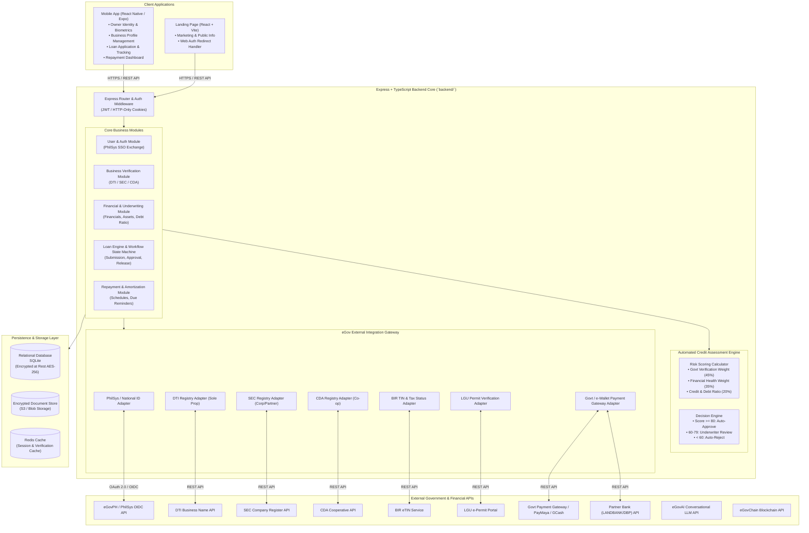
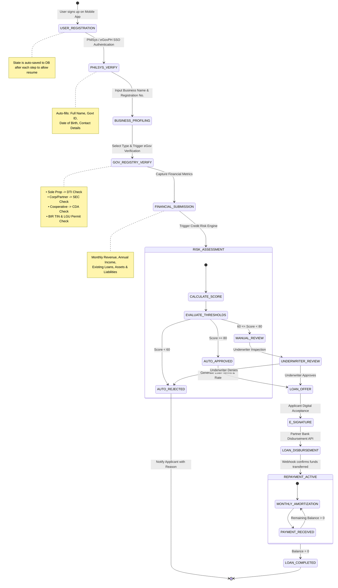

# System Architecture Overview: eMSME Loan Platform

## 1. Executive Summary & Architecture Vision
The **eMSME Platform** is designed to streamline micro, small, and medium enterprise (MSME) financing in the Philippines. By replacing manual paperwork with automated government API verifications (**PhilSys, DTI, SEC, CDA, BIR, LGU**), the platform reduces application processing time from weeks to minutes while minimizing fraud risks.

The application follows a **Mobile-First Client + Modular Backend API + External eGov Gateway** pattern:
- **Mobile Client (`mobile/`)**: Primary user-facing platform built with React Native (Expo SDK).
- **Backend API (`backend/`)**: Node.js + Express + TypeScript core services orchestrating identity verification, business checks, underwriting, loan release, and repayments.
- **Web Landing Page (`frontend/`)**: React + Vite static landing page for public marketing.

---

## 2. High-Level Architecture Diagram



---

## 3. End-to-End Loan Processing Workflow



---

## 4. Domain Data Models & Schema Design

### 4.1 TypeScript Entity Interfaces

```typescript
// ==========================================
// 1. User & Identity Profile (Owner)
// ==========================================
export interface UserProfile {
  id: string; // UUID
  philSysId?: string; // National ID number
  firstName: string;
  lastName: string;
  middleName?: string;
  email: string;
  mobileNumber: string;
  address: {
    street: string;
    barangay: string;
    cityMunicipality: string;
    province: string;
    postalCode: string;
  };
  isPhilSysVerified: boolean;
  createdAt: Date;
  updatedAt: Date;
}

// ==========================================
// 2. MSME Business Profile
// ==========================================
export type BusinessType = 'Sole Proprietorship' | 'Partnership' | 'Corporation' | 'Cooperative';

export interface BusinessProfile {
  id: string; // UUID
  ownerId: string; // Foreign key to UserProfile
  businessName: string;
  tradeName?: string;
  registrationNumber: string; // DTI / SEC / CDA Registration No.
  businessType: BusinessType;
  industryCategory: string; // e.g., Retail, Manufacturing, Services, Agriculture
  yearsInOperation: number;
  birTin: string; // 9 or 12 digit TIN
  lguPermitNumber?: string;
  lguMunicipality?: string;
  verificationStatus: {
    dtiSecCdaVerified: boolean;
    birTinVerified: boolean;
    lguPermitVerified: boolean;
    verifiedAt?: Date;
  };
  createdAt: Date;
  updatedAt: Date;
}

// ==========================================
// 3. Financial Information
// ==========================================
export interface ExistingLoan {
  lenderName: string;
  outstandingBalance: number;
  monthlyAmortization: number;
}

export interface FinancialProfile {
  id: string;
  businessId: string;
  monthlyRevenue: number;
  annualIncome: number;
  totalAssets: number;
  totalLiabilities: number;
  existingLoans: ExistingLoan[];
  debtServiceCoverageRatio?: number; // DSCR (Debt Service Coverage Ratio)

  declaredAt: Date;
}

// ==========================================
// 4. Loan Application & Credit Assessment
// ==========================================
export type LoanStatus =
  | 'DRAFT'
  | 'SUBMITTED'
  | 'UNDER_VERIFICATION'
  | 'UNDERWRITING'
  | 'APPROVED'
  | 'REJECTED'
  | 'DISBURSED'
  | 'REPAYMENT_ACTIVE'
  | 'COMPLETED'
  | 'DEFAULTED';

export interface CreditScoreResult {
  riskScore: number; // 0 - 100
  identityVerificationScore: number; // 0 - 25
  businessLegitimacyScore: number; // 0 - 25
  financialHealthScore: number; // 0 - 35
  creditHistoryScore: number; // 0 - 15
  decision: 'AUTO_APPROVE' | 'MANUAL_REVIEW' | 'AUTO_REJECT';
  rejectionReasons?: string[];
  assessedAt: Date;
}

export interface LoanApplication {
  id: string;
  applicantId: string;
  businessId: string;
  requestedAmount: number;
  tenorMonths: number;
  purpose: string;
  status: LoanStatus;
  creditScore?: CreditScoreResult;
  approvedAmount?: number;
  interestRateAnnual?: number;
  monthlyAmortization?: number;
  disbursedAt?: Date;
  createdAt: Date;
  updatedAt: Date;
}

// ==========================================
// 5. Loan Repayment Schedule
// ==========================================
export interface RepaymentInstallment {
  installmentNumber: number;
  dueDate: Date;
  principalAmount: number;
  interestAmount: number;
  totalAmountDue: number;
  status: 'PENDING' | 'PAID' | 'OVERDUE';
  paidAmount?: number;
  paidAt?: Date;
  transactionRef?: string;
}
```

---

## 5. eGov Integration Gateway Specification

The **eGov Integration Gateway** handles all server-to-server communications with government registries.

| Government Agency | API / Verification Target | Primary Purpose | Validation Logic |
|---|---|---|---|
| **eGovPH / PhilSys** | OIDC UserInfo / National ID API | Identity Authentication | Match Name, DOB, and National ID photo/hash. |
| **DTI (Dept. of Trade & Industry)** | DTI Business Name Registration API | Sole Proprietorship Verification | Verify active registration status and business name match. |
| **SEC (Securities & Exchange Comm.)** | SEC Company Register API | Corporations & Partnerships | Validate SEC Reg Number, active status, and corporate officers. |
| **CDA (Cooperative Dev. Authority)** | CDA Cooperative Registry | Cooperatives Verification | Check Registration Certificate and Good Standing status. |
| **BIR (Bureau of Internal Revenue)** | BIR eTIN Validation Service | Tax Registration Verification | Verify TIN validity and taxpayer registration status. |
| **LGU (Local Govt Unit)** | LGU Business Permit Database | Operating Permit Verification | Validate active Mayor's Permit number for current calendar year. |

---

## 6. Credit Assessment & Risk Scoring Rules

The Risk Scoring Engine calculates an overall score $S \in [0, 100]$:

$$S = S_{\text{Identity}} + S_{\text{Business}} + S_{\text{Financial}} + S_{\text{History}}$$

1. **Identity Verification ($S_{\text{Identity}}$, Max 25 Points):**
   - PhilSys Biometric/OIDC Verified: +25 Points.
   - Unverified / Manual ID Upload: +10 Points.

2. **Business Legitimacy ($S_{\text{Business}}$, Max 25 Points):**
   - DTI / SEC / CDA Active & Verified: +10 Points.
   - BIR TIN Verified: +8 Points.
   - LGU Permit Verified: +7 Points.

3. **Financial Health ($S_{\text{Financial}}$, Max 35 Points):**
   - Monthly Revenue / Requested Amortization Ratio $\ge 3.0$: +20 Points.
   - Debt-Service Coverage Ratio (DSCR) $\ge 1.5$: +15 Points.

4. **Operating History & Credit ($S_{\text{History}}$, Max 15 Points):**
   - Years in Operation $\ge 3$ Years: +10 Points.
   - No active defaulted loans declared: +5 Points.

---

## 7. Security, Data Privacy & Compliance

1. **Data Privacy Act of 2012 (RA 10173):**
   - User explicit consent recorded before triggering eGov agency queries.
   - Data minimisation: Store only verified verification flags and necessary loan metadata.
2. **Encryption:**
   - In Transit: TLS 1.3 enforced across all API routes and eGov gateway connections.
   - At Rest: AES-256 GCM encryption for PII (Personally Identifiable Information).
3. **Audit Logging:**
   - All government API queries and loan status changes logged in an immutable audit trail table.
