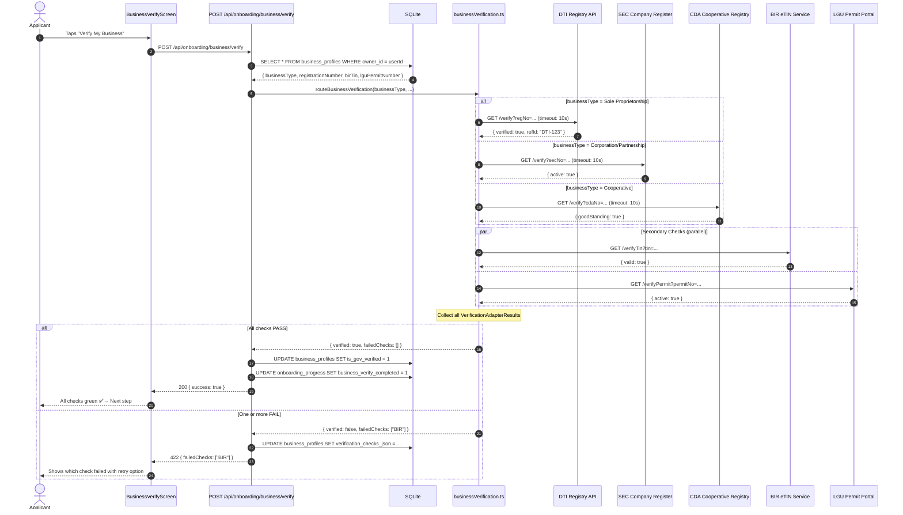

# Architecture: Business Verification (`business-verification`)

## 1. Verification Flow Diagram



## 2. Service Implementation

### `backend/src/services/businessVerification.ts`
```typescript
import axios from 'axios';

export type Agency = 'DTI' | 'SEC' | 'CDA' | 'BIR' | 'LGU';
export type BusinessType = 'Sole Proprietorship' | 'Partnership' | 'Corporation' | 'Cooperative';

export interface VerificationAdapterResult {
  agency: Agency;
  status: 'PASS' | 'FAIL' | 'TIMEOUT' | 'ERROR';
  verifiedAt?: string;
  referenceId?: string;
  errorMessage?: string;
}

const TIMEOUT_MS = 10_000;

async function callAdapter(agency: Agency, url: string, params: Record<string, string>): Promise<VerificationAdapterResult> {
  try {
    const res = await axios.get(url, { params, timeout: TIMEOUT_MS });
    const verified = res.data?.verified ?? res.data?.active ?? res.data?.valid ?? res.data?.goodStanding ?? false;
    return {
      agency,
      status: verified ? 'PASS' : 'FAIL',
      verifiedAt: new Date().toISOString(),
      referenceId: res.data?.refId ?? res.data?.referenceId,
    };
  } catch (err: any) {
    if (err.code === 'ECONNABORTED') {
      return { agency, status: 'TIMEOUT', errorMessage: `${agency} API timed out after ${TIMEOUT_MS}ms` };
    }
    return { agency, status: 'ERROR', errorMessage: err.message };
  }
}

export async function routeBusinessVerification(
  businessType: BusinessType,
  registrationNumber: string,
  birTin: string,
  lguPermitNumber?: string
): Promise<{ verified: boolean; results: VerificationAdapterResult[]; failedChecks: Agency[] }> {
  const primaryChecks: Promise<VerificationAdapterResult>[] = [];

  if (businessType === 'Sole Proprietorship') {
    primaryChecks.push(callAdapter('DTI', process.env.DTI_API_URL!, { regNo: registrationNumber }));
  } else if (businessType === 'Corporation' || businessType === 'Partnership') {
    primaryChecks.push(callAdapter('SEC', process.env.SEC_API_URL!, { secNo: registrationNumber }));
  } else if (businessType === 'Cooperative') {
    primaryChecks.push(callAdapter('CDA', process.env.CDA_API_URL!, { cdaNo: registrationNumber }));
  }

  const secondaryChecks: Promise<VerificationAdapterResult>[] = [
    callAdapter('BIR', process.env.BIR_API_URL!, { tin: birTin }),
    ...(lguPermitNumber ? [callAdapter('LGU', process.env.LGU_API_URL!, { permitNo: lguPermitNumber })] : []),
  ];

  // Run primary first (required), then secondary in parallel
  const [primaryResult] = await Promise.all(primaryChecks);
  const secondaryResults = await Promise.allSettled(secondaryChecks);

  const results: VerificationAdapterResult[] = [
    primaryResult,
    ...secondaryResults.map(r => r.status === 'fulfilled' ? r.value : { agency: 'BIR' as Agency, status: 'ERROR' as const }),
  ];

  const failedChecks = results
    .filter(r => r.status !== 'PASS')
    .map(r => r.agency);

  return {
    verified: failedChecks.length === 0,
    results,
    failedChecks,
  };
}
```

## 3. Required Environment Variables

```env
DTI_API_URL=https://staging.dti.gov.ph/api/v1/verify
SEC_API_URL=https://staging.sec.gov.ph/api/v1/verify
CDA_API_URL=https://staging.cda.gov.ph/api/v1/verify
BIR_API_URL=https://staging.bir.gov.ph/api/v1/verifyTin
LGU_API_URL=https://staging.lgu.gov.ph/api/v1/verifyPermit
```

## 4. SQLite Schema for Verification Results

```sql
-- Add to business_profiles table
ALTER TABLE business_profiles ADD COLUMN verification_checks_json TEXT;  -- JSON array of VerificationAdapterResult[]
ALTER TABLE business_profiles ADD COLUMN is_gov_verified INTEGER DEFAULT 0;
ALTER TABLE business_profiles ADD COLUMN bir_tin_verified INTEGER DEFAULT 0;
ALTER TABLE business_profiles ADD COLUMN lgu_permit_verified INTEGER DEFAULT 0;
ALTER TABLE business_profiles ADD COLUMN years_in_operation INTEGER DEFAULT 0;
ALTER TABLE business_profiles ADD COLUMN verified_at TEXT;
```
