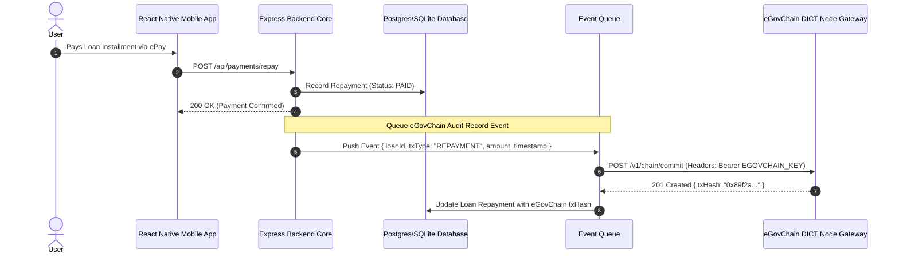

# Architecture: eGovChain Transaction Tracking (`eblockchain`)

## 1. Sequence Diagram



## 2. Data Models & Schemas

### eGovChain Audit Event Payload
```json
{
  "event": "LOAN_REPAYMENT_COMMITTED",
  "payload": {
    "loanId": "loan_uuid_9921",
    "borrowerHash": "sha256_hash_user",
    "amountPHP": 5000.00,
    "installmentNumber": 3,
    "timestamp": 1784589200
  }
}
```

### Response from eGovChain Gateway
```json
{
  "status": "COMMITTED",
  "blockNumber": 1420982,
  "txHash": "0x8f1e2d3c4b5a69780123456789abcdef0123456789abcdef0123456789abcdef"
}
```

## 3. Security & Queue Resilience
- **Asynchronous Commitment:** eGovChain commits are queued in background workers to avoid slowing down user API responses.
- **Privacy Preservation:** No PII or plain names are stored on eGovChain; only salted SHA-256 hashes of user IDs and transaction metrics are stored.
