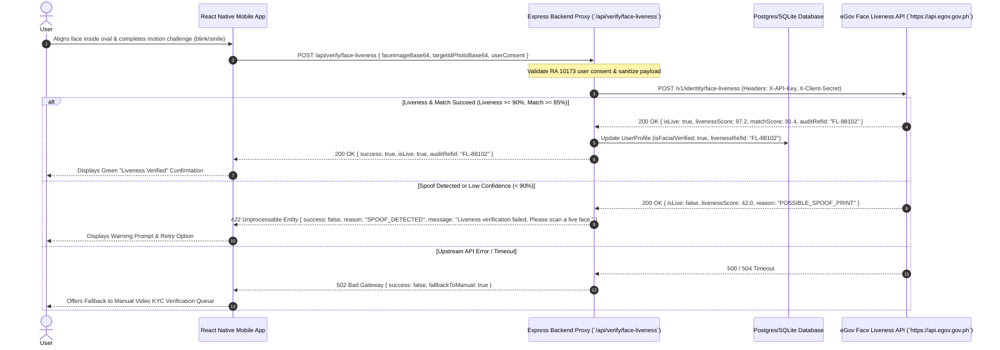

# Architecture: eGov Face Liveness & Biometric Verification (`efacial-recog`)

## 1. Sequence Diagram (Data Flow)



## 2. API Integration Specifications & Tab Documentation

### 2.1 Endpoint Specification (Integration Tab)
- **HTTP Method:** `POST`
- **Gateway URL:** `https://api.egov.gov.ph/v1/identity/face-liveness`
- **Authentication:** Server-to-Server Headers (`X-API-Key: <EGOV_FACE_LIVENESS_KEY>`, `X-Client-Secret: <EGOV_FACE_LIVENESS_SECRET>`)

### 2.2 Schemas Tab

#### Request Payload (`POST /api/verify/face-liveness`)
```json
{
  "faceImageBase64": "data:image/jpeg;base64,/9j/4AAQSkZJRg...",
  "targetIdPhotoBase64": "data:image/jpeg;base64,/9j/4AAQSkZJRg...",
  "checkType": "PASSIVE_AND_ACTIVE",
  "userConsent": true
}
```

#### Upstream Response (`200 OK`)
```json
{
  "audit_ref_id": "FL-PHILSYS-20260721-99012",
  "is_live": true,
  "liveness_score": 97.5,
  "match_score": 92.1,
  "anti_spoofing_flags": {
    "print_attack_detected": false,
    "screen_replay_detected": false,
    "deepfake_detected": false
  },
  "processed_at": "2026-07-21T14:32:00Z"
}
```

#### Client Response Payload (`200 OK`)
```json
{
  "success": true,
  "isLive": true,
  "livenessScore": 97.5,
  "matchScore": 92.1,
  "auditRefId": "FL-PHILSYS-20260721-99012"
}
```

---

## 3. Security Tab: Biometric Data Protection
1. **RA 10173 Compliance:** Explicit user consent required before camera activation.
2. **In-Memory Volatile Processing:** Base64 facial images are held in volatile RAM only for the duration of the HTTP API call and purged immediately afterwards.
3. **Transit Security:** TLS 1.3 encryption required for all mobile-to-backend and backend-to-eGov network calls.
