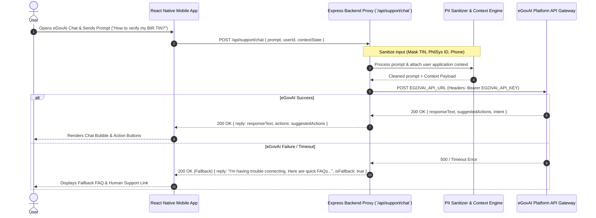

# Architecture: eGovAI Intelligent Support Assistant (`egov-ai`)

## 1. Sequence Diagram



## 2. API Data Schemas & Payload Structures

### Request Payload (`POST /api/support/chat`)
```json
{
  "prompt": "What documents do I need for a Sole Proprietorship loan?",
  "sessionId": "chat_sess_89231",
  "applicationContext": {
    "currentStep": "BUSINESS_VERIFICATION",
    "businessType": "Sole Proprietorship",
    "isPhilSysVerified": true
  }
}
```

### eGovAI Gateway API Request (`POST EGOVAI_API_URL`)
```json
{
  "messages": [
    { "role": "system", "content": "You are eGovAI, official assistant for Philippine MSME loan applicants." },
    { "role": "user", "content": "What documents do I need for a Sole Proprietorship loan? [Context: Business Type: Sole Proprietorship]" }
  ],
  "temperature": 0.3,
  "max_tokens": 500
}
```

### Response Payload (`POST /api/support/chat`)
```json
{
  "success": true,
  "reply": "For a Sole Proprietorship, you need a verified DTI Business Name Certificate, BIR TIN, and active LGU Mayor's Permit.",
  "suggestedActions": [
    { "label": "Verify DTI Registration", "action": "NAVIGATE_DTI_VERIFY" },
    { "label": "Check BIR Status", "action": "NAVIGATE_BIR_VERIFY" }
  ]
}
```

## 3. Security & Privacy Guardrails
- **PII Stripping:** Phone numbers, 12-digit PhilSys IDs, and financial account numbers are sanitized regex-matched before dispatch to external LLMs.
- **API Key Storage:** `EGOVAI_API_KEY` stored exclusively in server environment variables.
- **Context Injection:** Application state injected into system prompt so answers match user's actual step in eMSME.
