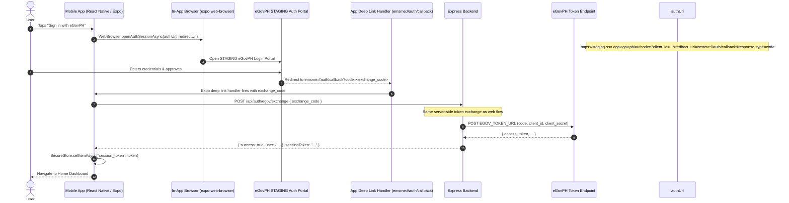

# Architecture: Mobile eGovPH SSO (`egov-sso-mobile`)

## 1. Mobile Auth Flow



## 2. Component Boundaries

### Mobile (`mobile/src/screens/EGovSSOScreen.tsx`)
- Renders a login screen with "Sign in with eGovPH" button.
- Constructs STAGING OAuth authorization URL with `EXPO_PUBLIC_EGOV_CLIENT_ID` and `redirect_uri = emsme://auth/callback`.
- Calls `WebBrowser.openAuthSessionAsync(url, redirectUri)` from `expo-web-browser`.
- Handles the `WebBrowserResultType.SUCCESS` result to extract `exchange_code` from URL.
- POSTs `exchange_code` to backend via `fetch` or Axios.
- Stores returned session token in `expo-secure-store`.
- Handles `WebBrowserResultType.CANCEL` (user dismissed) and network errors.

### Backend (`backend/src/routes/auth/egov.ts`)
- **No changes required** — the same `POST /api/auth/egov/exchange` endpoint serves both web and mobile.

## 3. Deep Link Registration (Expo)
```json
// app.json / app.config.js
{
  "expo": {
    "scheme": "emsme",
    "android": { "intentFilters": [{ "action": "VIEW", "data": [{ "scheme": "emsme" }] }] },
    "ios": { "bundleIdentifier": "ph.gov.emsme" }
  }
}
```

## 4. Session Storage Model
- **Store:** `expo-secure-store` (AES-256 hardware-backed on supported devices)
- **Key:** `emsme_session_token`
- **Value:** Signed JWT returned from backend
- **Rationale:** AsyncStorage is NOT encrypted. SecureStore is required for auth tokens.

## 5. Security Guardrails
- `EXPO_PUBLIC_EGOV_CLIENT_ID` is public (used in authorization URL only — no secret).
- `EGOV_CLIENT_SECRET` remains strictly on the backend.
- Session token stored in SecureStore, never in AsyncStorage or Redux state.
- Deep link scheme `emsme://` is registered — prevents URL hijacking by other apps.
