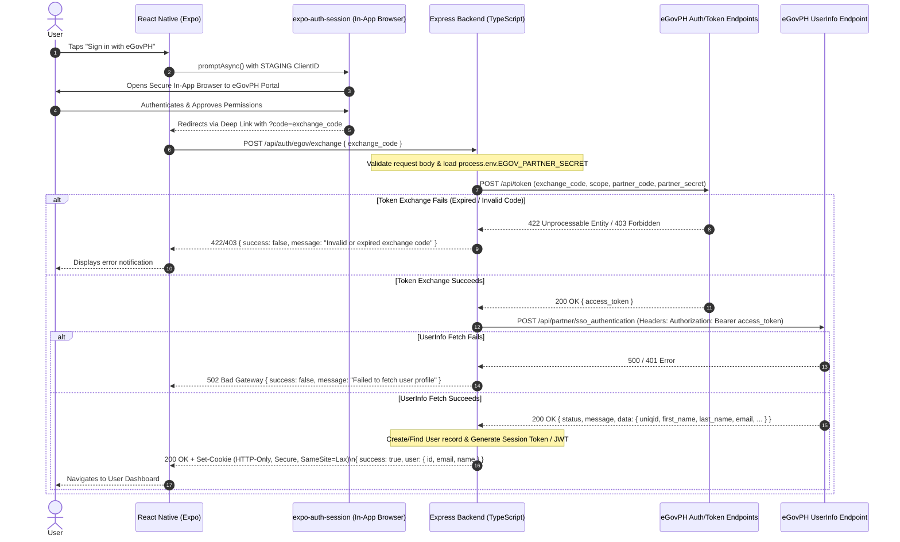

# Architecture: eGovPH SSO Integration (`egov-sso`)

## 1. Sequence Diagram



## 2. Component Boundaries & Responsibilities

### Mobile Client (`mobile/src/hooks/useEGovAuth.ts` & `LoginScreen.tsx`)
- Uses `expo-auth-session` to manage the OAuth2 Authorization Code flow.
- Configures the authorization endpoint to point to eGovPH SSO portal.
- Handles the deep link redirect via `makeRedirectUri()`.
- Sends the captured `exchange_code` to the Express backend endpoint `/api/auth/egov/exchange`.
- Handles UI state (loading spinner, error messages).

### Backend (`backend/src/routes/auth/egov.ts`)
- Implements `POST /api/auth/egov/exchange` endpoint.
- Enforces strict input validation on `exchange_code`.
- Performs server-to-server POST to `EGOV_BASE_URL/api/token` including `EGOV_PARTNER_SECRET`.
- Performs POST request to `EGOV_BASE_URL/api/partner/sso_authentication` using `access_token`.
- Creates secure HTTP-only cookie (`emsme_session`) containing session payload.
- Returns clean JSON response without leaking access tokens or backend secrets.

## 3. Data Models & API Payload Structures

### Request Payload (`POST /api/auth/egov/exchange`)
```json
{
  "exchange_code": "egov_code_abc123xyz"
}
```

### eGovPH Token Response (`/api/token`)
```json
{
  "access_token": "eyJhbGciOi..."
}
```

### eGovPH UserInfo Response (`/api/partner/sso_authentication`)
```json
{
  "status": 200,
  "message": "OK",
  "data": {
    "uniqid": "MVPCBEUVCGPZR",
    "email": "josie@yopmail.com",
    "birth_date": "1990-01-01",
    "first_name": "JOSIE",
    "middle_name": "SANTOS",
    "last_name": "DELA CRUZ",
    "mobile": "+639090000000",
    "address": "1123 RIZAL ST., POBLACION, CITY OF ALAMINOS, PANGASINAN, PHILIPPINES",
    "gender": "female",
    "nationality": "Filipino",
    "photo": "https://staging-files.oueg.info/staging/..."
  }
}
```

### Backend Success Response (`POST /api/auth/egov/exchange`)
```json
{
  "success": true,
  "user": {
    "id": "egov-user-98765",
    "email": "juan.delacruz@example.gov.ph",
    "firstName": "Juan",
    "lastName": "Dela Cruz"
  }
}
```

## 4. Security Guardrails & Cookies
- **Zero Client-Side Secret Exposure:** `EGOV_PARTNER_SECRET` must ONLY be referenced in `backend/` via `process.env.EGOV_PARTNER_SECRET`.
- **Session Cookie Policy:**
  - `HttpOnly`: `true` (Prevents XSS theft)
  - `Secure`: `true` in production (`process.env.NODE_ENV === 'production'`)
  - `SameSite`: `'lax'` or `'strict'` (Mitigates CSRF)
  - `Path`: `'/'`
  - `MaxAge`: `24 * 60 * 60 * 1000` (24 hours)
