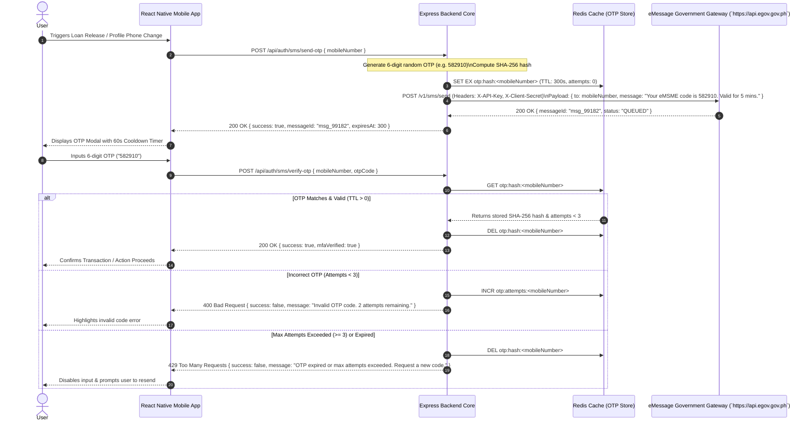

# Architecture: eMessage SMS Authentication & Notifications (`emessage-sms`)

## 1. Sequence Diagram (OTP Dispatch & Verification Flow)



## 2. API Integration Specifications & Tab Documentation

### 2.1 Endpoint Specification (Integration Tab)
- **HTTP Method:** `POST`
- **Gateway URL:** `https://api.egov.gov.ph/v1/sms/send`
- **Authentication:** Headers (`X-API-Key: <EMESSAGE_API_KEY>`, `X-Client-Secret: <EMESSAGE_CLIENT_SECRET>`)

### 2.2 Schemas Tab

#### Request Payload (`POST /api/auth/sms/send-otp`)
```json
{
  "mobileNumber": "+639171234567",
  "action": "DISBURSEMENT_RELEASE"
}
```

#### Upstream eMessage Gateway Request Payload (`POST https://api.egov.gov.ph/v1/sms/send`)
```json
{
  "recipient": "+639171234567",
  "sender_id": "eMSME-eGov",
  "message": "Your eMSME verification code is 582910. Valid for 5 minutes. Do not share this code with anyone.",
  "priority": "HIGH"
}
```

#### Upstream Response (`200 OK`)
```json
{
  "message_id": "MSG-EMESSAGE-20260721-88192",
  "recipient": "+639171234567",
  "status": "DELIVERED_TO_GATEWAY",
  "timestamp": "2026-07-21T14:37:00Z"
}
```

#### Verification Request Payload (`POST /api/auth/sms/verify-otp`)
```json
{
  "mobileNumber": "+639171234567",
  "otpCode": "582910"
}
```

---

## 3. Security Tab: Protection Policies
1. **SHA-256 Hashing:** OTP codes are hashed with SHA-256 before storage in Redis. Plaintext OTPs never exist in Redis keys or database tables.
2. **5-Minute Expiration (TTL):** OTPs auto-expire after 300 seconds.
3. **Attempt Limit:** Maximum 3 failed attempts before the OTP is invalidated.
4. **Rate Limiting:** Maximum 3 SMS dispatch requests per phone number per hour.
