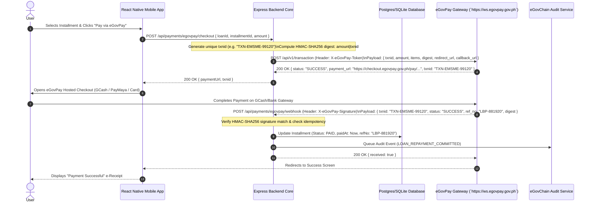

# Architecture: eGovPay Payment Gateway (`epay`)

## 1. Sequence Diagram (Repayment & Webhook Sync Flow)



## 2. API Integration Specifications & Tab Documentation

### 2.1 Endpoint Specification (Integration Tab)
- **HTTP Method:** `POST`
- **Gateway Base URL:** `https://ws.egovpay.gov.ph`
- **Transaction Endpoint:** `/api/v1/transaction`
- **Authentication Header:** `X-eGovPay-Token: <EGOVPAY_API_TOKEN>`

### 2.2 Schemas Tab

#### Backend Checkout Request (`POST /api/payments/egovpay/checkout`)
```json
{
  "loanId": "loan_uuid_88291",
  "installmentId": "inst_03",
  "amount": 5000.00,
  "mobileNumber": "+639171234567"
}
```

#### Upstream eGovPay Request (`POST https://ws.egovpay.gov.ph/api/v1/transaction`)
```json
{
  "txnid": "TXN-EMSME-20260721-99120",
  "amount": "5000.00",
  "items": [
    { "name": "eMSME Loan Amortization - Installment #3", "amount": "5000.00" }
  ],
  "settlement_template_uuid": "template_uuid_landbank_01",
  "redirect_url": "emsme://payment-success",
  "callback_url": "https://api.emsme.gov.ph/api/payments/egovpay/webhook",
  "digest": "b8a92f01c8932e01f...",
  "mobile": "+639171234567"
}
```

#### Upstream Response (`200 OK`)
```json
{
  "status": "SUCCESS",
  "payment_url": "https://checkout.egovpay.gov.ph/pay/session_abc123",
  "txnid": "TXN-EMSME-20260721-99120"
}
```

#### Webhook Callback Payload (`POST /api/payments/egovpay/webhook`)
```json
{
  "txnid": "TXN-EMSME-20260721-99120",
  "status": "PAID",
  "amount": "5000.00",
  "payment_channel": "GCASH",
  "reference_no": "GCASH-REF-889102",
  "paid_at": "2026-07-21T14:40:00Z",
  "digest": "b8a92f01c8932e01f..."
}
```

---

## 3. Security Tab: Data Protection & Integrity
1. **HMAC-SHA256 Digest Verification:**
   All webhooks verify `digest = HMAC_SHA256(amount + "|" + txnid, EGOVPAY_API_SECRET)` before accepting transaction status updates.
2. **Idempotence Enforced:**
   Backend maintains a `processed_webhooks` table ensuring duplicate webhook retries do not credit an account twice.
3. **Cardholder Data Non-Persistence:**
   No credit card, e-wallet PINs, or banking credentials ever touch eMSME servers; all payments occur securely on hosted eGovPay interfaces.
