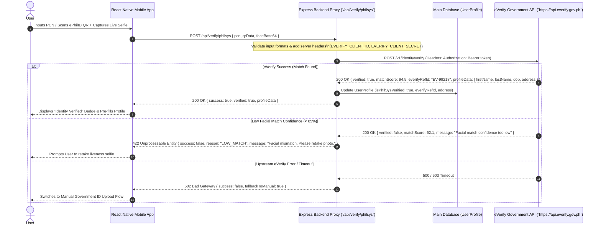

# Architecture: eVerify PhilSys Identity Verification (`everify`)

## 1. Sequence Diagram & Integration Architecture



## 2. API Specifications & Data Schemas (Integration Tab)

### 2.1 Backend Proxy Route: `POST /api/verify/philsys`

#### Request Payload
```json
{
  "pcn": "1234-5678-9012",
  "qrData": "eyJhbGciOiJSUzI1NiIs...",
  "faceBase64": "data:image/jpeg;base64,/9j/4AAQSkZJRg...",
  "userConsent": true
}
```

#### Upstream eVerify API Request (`POST https://api.everify.gov.ph/v1/identity/verify`)
```json
{
  "pcn": "123456789012",
  "qr_payload": "eyJhbGciOiJSUzI1NiIs...",
  "facial_template": "base64_string_here",
  "consent_timestamp": "2026-07-21T14:27:00Z"
}
```

#### Upstream Response (`200 OK`)
```json
{
  "verification_id": "EV-PHILSYS-20260721-88912",
  "verified": true,
  "facial_match_confidence": 94.5,
  "demographics": {
    "first_name": "JUAN",
    "last_name": "DELA CRUZ",
    "middle_name": "SANTOS",
    "date_of_birth": "1990-05-15",
    "gender": "MALE",
    "address": {
      "street": "123 Mabini St",
      "barangay": "Barangay 1",
      "city_municipality": "Manila",
      "province": "Metro Manila",
      "postal_code": "1000"
    }
  }
}
```

#### Client Success Response (`200 OK`)
```json
{
  "success": true,
  "verified": true,
  "everifyRefId": "EV-PHILSYS-20260721-88912",
  "profileData": {
    "firstName": "JUAN",
    "lastName": "DELA CRUZ",
    "middleName": "SANTOS",
    "dateOfBirth": "1990-05-15",
    "address": "123 Mabini St, Barangay 1, Manila, Metro Manila"
  }
}
```

---

## 3. Data Privacy & Security Policies
1. **Zero Raw Biometric Storage:** `faceBase64` is processed in-memory for the duration of the API call and immediately purged from RAM. It is **never** written to database tables or file logs.
2. **Explicit Consent:** Applicant must check a Data Privacy Act (RA 10173) consent checkbox before invoking eVerify.
3. **Secret Storage:** `EVERIFY_CLIENT_SECRET` exists strictly in server environment variables.
