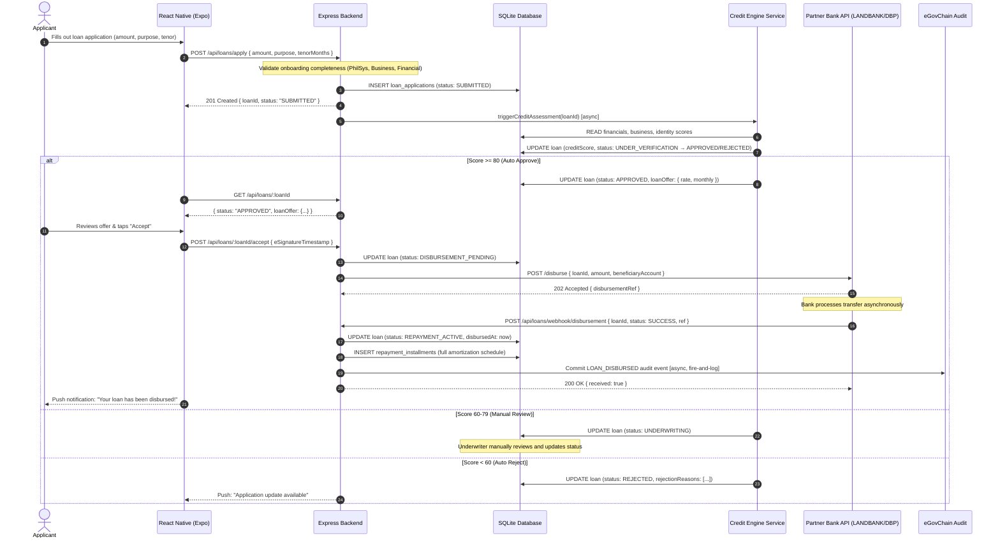

# Architecture: Loan Module (`loan-module`)

## 1. State Machine Sequence Diagram



## 2. API Endpoint Definitions

| Method | Route | Auth | Description |
|---|---|---|---|
| `POST` | `/api/loans/apply` | JWT Required | Submit a new loan application |
| `GET` | `/api/loans/:loanId` | JWT Required | Get full loan detail + status |
| `GET` | `/api/loans/my` | JWT Required | List all loans for authenticated user |
| `POST` | `/api/loans/:loanId/accept` | JWT Required | Accept loan offer (e-signature) |
| `POST` | `/api/loans/webhook/disbursement` | HMAC Signature | Partner bank disbursement callback |

## 3. SQLite Database Schema

```sql
-- Loan Applications Table
CREATE TABLE loan_applications (
    id TEXT PRIMARY KEY,                  -- UUID
    applicant_id TEXT NOT NULL,
    business_id TEXT NOT NULL,
    requested_amount REAL NOT NULL,
    approved_amount REAL,
    tenor_months INTEGER NOT NULL,
    purpose TEXT NOT NULL,
    status TEXT NOT NULL DEFAULT 'DRAFT', -- LoanStatus enum
    interest_rate_annual REAL,
    monthly_amortization REAL,
    credit_score_json TEXT,               -- JSON blob of CreditScoreResult
    rejection_reasons_json TEXT,          -- JSON array
    disbursement_ref TEXT,
    disbursed_at TEXT,                    -- ISO timestamp
    e_signed_at TEXT,
    created_at TEXT NOT NULL DEFAULT (datetime('now')),
    updated_at TEXT NOT NULL DEFAULT (datetime('now')),
    FOREIGN KEY (applicant_id) REFERENCES users(id),
    FOREIGN KEY (business_id) REFERENCES business_profiles(id)
);

-- Repayment Installments Table
CREATE TABLE repayment_installments (
    id TEXT PRIMARY KEY,
    loan_id TEXT NOT NULL,
    installment_number INTEGER NOT NULL,
    due_date TEXT NOT NULL,               -- ISO date
    principal_amount REAL NOT NULL,
    interest_amount REAL NOT NULL,
    total_amount_due REAL NOT NULL,
    status TEXT NOT NULL DEFAULT 'PENDING', -- PENDING | PAID | OVERDUE
    paid_amount REAL,
    paid_at TEXT,
    transaction_ref TEXT,
    FOREIGN KEY (loan_id) REFERENCES loan_applications(id)
);
```

## 4. Request/Response Schemas

### POST /api/loans/apply
```json
{
  "requestedAmount": 250000,
  "tenorMonths": 12,
  "purpose": "Working capital for inventory expansion"
}
```

### POST /api/loans/:loanId/accept (E-Signature)
```json
{
  "agreedToTerms": true,
  "eSignatureTimestamp": "2026-07-21T15:30:00Z"
}
```

### POST /api/loans/webhook/disbursement (Partner Bank)
```json
{
  "loanId": "loan_uuid_88291",
  "status": "SUCCESS",
  "disbursedAmount": 250000.00,
  "disbursementRef": "LBP-DISBURSE-881920",
  "disbursedAt": "2026-07-21T14:00:00Z",
  "signature": "HMAC-SHA256-of-payload"
}
```

## 5. State Transition Guard Logic

```typescript
type LoanStatus = 'DRAFT' | 'SUBMITTED' | 'UNDER_VERIFICATION' | 'UNDERWRITING' 
  | 'APPROVED' | 'REJECTED' | 'DISBURSEMENT_PENDING' | 'REPAYMENT_ACTIVE' | 'COMPLETED' | 'DEFAULTED';

const VALID_TRANSITIONS: Record<LoanStatus, LoanStatus[]> = {
  DRAFT:                ['SUBMITTED'],
  SUBMITTED:            ['UNDER_VERIFICATION'],
  UNDER_VERIFICATION:   ['APPROVED', 'UNDERWRITING', 'REJECTED'],
  UNDERWRITING:         ['APPROVED', 'REJECTED'],
  APPROVED:             ['DISBURSEMENT_PENDING', 'REJECTED'],
  REJECTED:             [],
  DISBURSEMENT_PENDING: ['REPAYMENT_ACTIVE'],
  REPAYMENT_ACTIVE:     ['COMPLETED', 'DEFAULTED'],
  COMPLETED:            [],
  DEFAULTED:            [],
};

function assertValidTransition(from: LoanStatus, to: LoanStatus): void {
  if (!VALID_TRANSITIONS[from].includes(to)) {
    throw new Error(`Invalid state transition: ${from} → ${to}`);
  }
}
```
