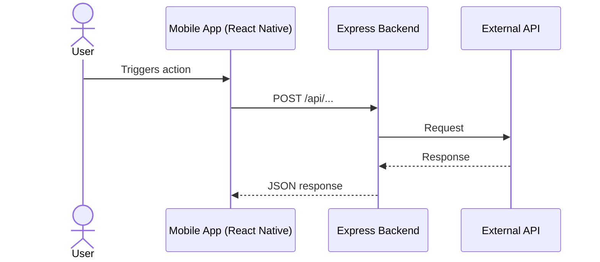

# Architecture: [FEATURE_NAME]

## 1. Data Model / Schema
*Define TypeScript interfaces, Zod schemas, database tables, or API interfaces used.*

```typescript
export interface ExampleRequest {
  fieldName: string; // required, description
}
```

## 2. Component Structure / Data Flow
*Detail how data flows between mobile, backend, and external APIs. Use a Mermaid diagram where helpful.*



## 3. Security & Error Handling
*List authentication, validation (Zod), error codes, and fallback strategies.*

| Error Condition | HTTP Status | Response Message |
|---|---|---|
| Missing required field | 400 | "Field X is required." |
| Upstream API failure | 502 | "External service unavailable." |
| Unauthorized access | 401 | "Authentication required." |
