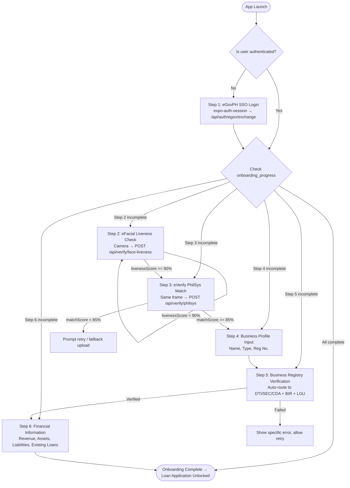

# Architecture: User Onboarding (`user-onboarding`)

## 1. Step Flow Diagram



## 2. Onboarding Progress SQLite Schema

```sql
CREATE TABLE onboarding_progress (
    user_id TEXT PRIMARY KEY,
    egov_sso_completed INTEGER DEFAULT 0,       -- boolean
    efacial_completed INTEGER DEFAULT 0,
    everify_completed INTEGER DEFAULT 0,
    business_profile_id TEXT,                    -- FK to business_profiles
    business_verify_completed INTEGER DEFAULT 0,
    financial_profile_id TEXT,                   -- FK to financial_profiles
    financials_completed INTEGER DEFAULT 0,
    current_step TEXT DEFAULT 'EGOV_SSO',       -- Latest incomplete step key
    completed_at TEXT,                           -- ISO timestamp when all done
    updated_at TEXT NOT NULL DEFAULT (datetime('now')),
    FOREIGN KEY (user_id) REFERENCES users(id)
);
```

## 3. Onboarding Status API Response

### GET /api/onboarding/status
```json
{
  "success": true,
  "currentStep": "BUSINESS_VERIFY",
  "percentComplete": 66,
  "steps": {
    "EGOV_SSO": "COMPLETE",
    "EFACIAL": "COMPLETE",
    "EVERIFY": "COMPLETE",
    "BUSINESS_PROFILE": "COMPLETE",
    "BUSINESS_VERIFY": "PENDING",
    "FINANCIALS": "LOCKED"
  }
}
```

## 4. Business Verification Routing Logic

```typescript
type BusinessType = 'Sole Proprietorship' | 'Partnership' | 'Corporation' | 'Cooperative';

async function routeBusinessVerification(
  businessType: BusinessType,
  registrationNumber: string,
  birTin: string,
  lguPermitNumber: string
): Promise<{ verified: boolean; failedChecks: string[] }> {
  const failedChecks: string[] = [];

  // Primary registry check
  if (businessType === 'Sole Proprietorship') {
    const dtiOk = await dtiAdapter.verify(registrationNumber);
    if (!dtiOk) failedChecks.push('DTI');
  } else if (businessType === 'Corporation' || businessType === 'Partnership') {
    const secOk = await secAdapter.verify(registrationNumber);
    if (!secOk) failedChecks.push('SEC');
  } else if (businessType === 'Cooperative') {
    const cdaOk = await cdaAdapter.verify(registrationNumber);
    if (!cdaOk) failedChecks.push('CDA');
  }

  // Universal secondary checks
  const birOk = await birAdapter.verify(birTin);
  if (!birOk) failedChecks.push('BIR');

  if (lguPermitNumber) {
    const lguOk = await lguAdapter.verify(lguPermitNumber);
    if (!lguOk) failedChecks.push('LGU');
  }

  return { verified: failedChecks.length === 0, failedChecks };
}
```

## 5. Mobile Screen Map

| Screen | Route | Purpose |
|---|---|---|
| `LoginScreen` | `/login` | eGovPH SSO entry point |
| `FaceLivenessScreen` | `/onboarding/face` | eFacial camera scanner |
| `IdentityVerifyScreen` | `/onboarding/identity` | eVerify result display |
| `BusinessProfileScreen` | `/onboarding/business` | Form: name, type, reg no. |
| `BusinessVerifyScreen` | `/onboarding/business/verify` | Trigger + status of registry check |
| `FinancialsScreen` | `/onboarding/financials` | Revenue, assets, liabilities form |
| `OnboardingCompleteScreen` | `/onboarding/complete` | All steps done → CTA to apply |
